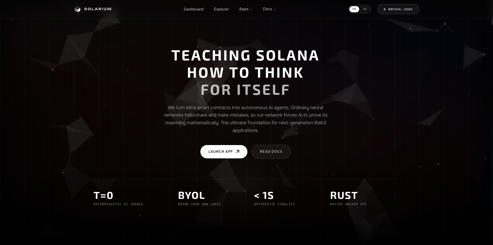
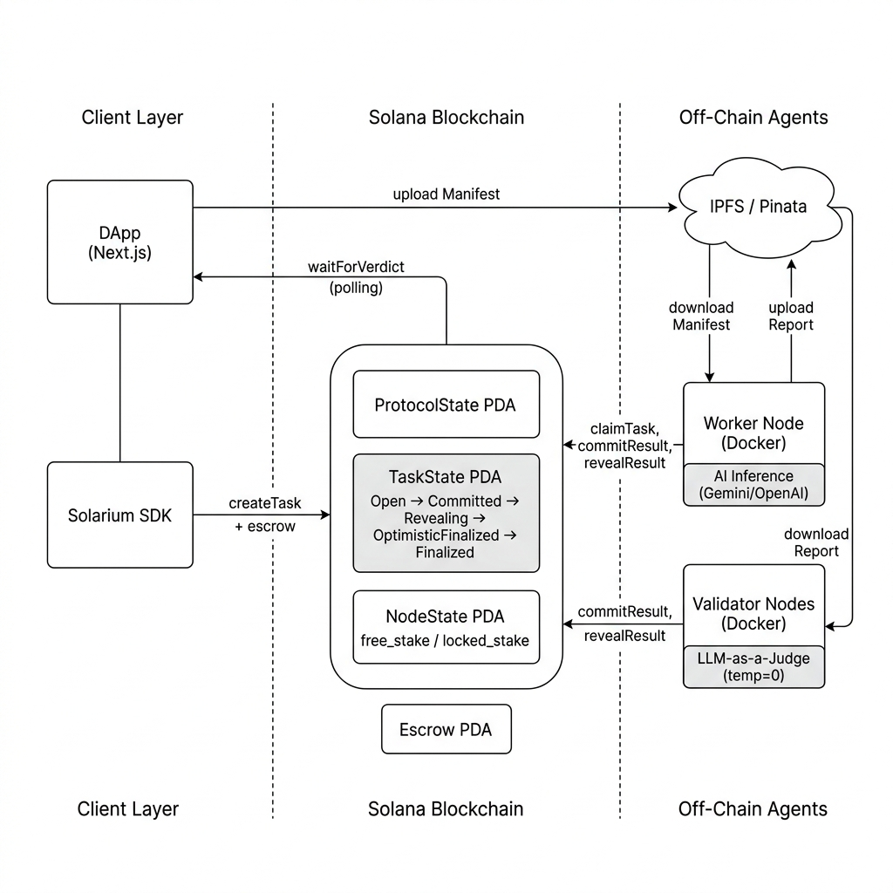

<div align="center">
  
  <h1>Solarium Protocol</h1>
  <p><b>Decentralized AI Oracle Infrastructure for Solana</b></p>
  <p>On-chain consensus layer that makes AI inference verifiable, accountable, and trustless.<br/>Any developer can integrate it. Anyone can run a node and earn rewards.</p>

  [](LICENSE)
  [](https://solana.com)
  [](https://www.anchor-lang.com)
  [](#testing)
  [](https://colosseum.org)

  [Live Demo](#) · [Video Pitch](#) · [Architecture](#architecture) · [Colosseum Submission](#)
</div>

---



---

<table>
<tr><td><b>Hackathon</b></td><td>Solana National Hackathon / Colosseum 2026</td></tr>
<tr><td><b>Track</b></td><td>AI + Blockchain: Autonomous Smart Contracts</td></tr>
<tr><td><b>Founder</b></td><td>Danial Kerimkul - <a href="https://t.me/webdeveloperkz">@webdeveloperkz</a></td></tr>
<tr><td><b>Role</b></td><td>Solo developer. Smart contracts, agents, SDK, frontend.</td></tr>
</table>

---

## What is Solarium?

Solarium is infrastructure for Solana developers who need their smart contracts to act autonomously on real-world data - text analysis, image evaluation, document parsing, risk scoring, market signals - without trusting a centralized API.

Instead of your DApp calling one AI endpoint and blindly writing the result on-chain, Solarium routes your request through a network of independent, staked nodes that each run their own AI inference, cross-check each other cryptographically, and reach on-chain consensus. The AI verdict directly mutates smart contract state: it changes `TaskState.status`, triggers escrow releases, and initiates slashing - all autonomously, with no human in the loop.

If a node lies or hallucinates, it loses real money (staked SOL). If it performs honestly, it earns rewards. The protocol is designed as a building block - you build products on top of it. The smart contract does not care what the AI is analyzing. It only enforces the rules: stake, commit, reveal, verify, pay or slash.

Here is what becomes possible when AI decisions carry financial consequences:

> **Finance** - DeFi liquidation triggers, risk scoring, and portfolio rebalancing verified by multiple AI models, not one oracle endpoint<br/>
> **Insurance** - parametric payouts for drought, flood, or earthquake without human adjusters or weeks of bureaucratic delay<br/>
> **Real Estate** - anti-corruption auditing of construction estimates before DAO treasury releases funds to contractors<br/>
> **Energy** - utility meter verification where AI cross-references consumption data against billing to detect overcharges or fraud<br/>
> **Compliance** - KYC/AML document analysis where the AI verdict is cryptographically sealed on-chain and audit-ready<br/>
> **Supply Chain** - quality inspection reports verified by independent AI judges before payment release to suppliers<br/>
> **Bug Bounties** - exploit verification in a sandboxed simulation where payout is guaranteed by escrow if the bug is real<br/>
> **Legal** - smart contract-triggered arbitration where AI evaluates evidence submitted by both parties and enforces a binding outcome

---

## The Problem

Smart contracts on Solana are powerful at deterministic logic. Transfer tokens, swap assets, enforce time-locks - they do this perfectly. But they are fundamentally blind to anything that requires judgment. This means they cannot adapt to changing conditions, cannot process unstructured information, and cannot make the kind of decisions that real-world applications demand.

A smart contract cannot read a construction estimate and decide if the prices are inflated. It cannot look at satellite imagery and determine if a drought destroyed crops. It cannot analyze an energy bill and flag suspicious consumption patterns. It cannot evaluate a bug report and confirm the exploit is real.

Today the industry workaround is simple: call an AI API off-chain (OpenAI, Gemini, Claude), get a response, write it on-chain. But this is just centralized control with extra steps:

- **The AI hallucinates.** It approves a fraudulent $1M insurance claim. Nobody is financially liable. The AI cannot be fined or slashed. The operator walks away.
- **The API gets compromised.** A leaked key or prompt injection forces any verdict the attacker wants. There is no second opinion, no cross-validation, no fallback.
- **The server goes down.** One endpoint, one failure mode. The entire protocol stops.
- **No on-chain enforcement.** The AI produces a recommendation, but a human still decides whether to execute it. The smart contract is not truly autonomous.

Solarium solves this by making AI a first-class participant in on-chain logic. The AI decision directly changes smart contract state - a finalized verdict triggers escrow release, blocks a payment, or initiates a payout. No manual intervention. Full autonomy with full accountability.

---

## How It Works

<table>
<tr><td width="40"><b>1</b></td><td><b>Task Creation</b></td><td>A developer uploads a TaskManifest (analysis prompt, JSON schema, judge criteria) to IPFS and locks escrow on-chain via the Solarium SDK.</td></tr>
<tr><td><b>2</b></td><td><b>Worker Inference</b></td><td>A staked Worker node claims the task, downloads the manifest, runs AI inference (Gemini, OpenAI, or local models), and uploads a structured JSON report to IPFS.</td></tr>
<tr><td><b>3</b></td><td><b>Blind Commit</b></td><td>The Worker submits <code>hash(verdict + salt)</code> on-chain. The answer is sealed - nobody can see or copy it.</td></tr>
<tr><td><b>4</b></td><td><b>Validator Judging</b></td><td>Independent Validator nodes download the Worker's report and evaluate it using the <b>LLM-as-a-Judge</b> paradigm at <code>temperature=0</code>. Each submits their own blind commitment.</td></tr>
<tr><td><b>5</b></td><td><b>Reveal</b></td><td>All nodes open their commitments. The contract verifies every hash matches.</td></tr>
<tr><td><b>6</b></td><td><b>On-Chain State Change</b></td><td>If consensus is reached, the contract autonomously transitions <code>TaskState</code> to <code>OptimisticFinalized</code>, distributes rewards, and enters a Challenge Window. No human approval needed.</td></tr>
<tr><td><b>7</b></td><td><b>Slashing</b></td><td>Nodes that lied or produced manipulated results lose their staked SOL. This is not a penalty flag - it is an automatic, atomic deduction from locked capital.</td></tr>
</table>

The key property: **AI inference directly triggers on-chain transactions and state mutations.** The smart contract does not wait for a human to approve the AI's verdict. Once consensus is reached, the result is final and the financial consequences execute immediately.

---

## For Developers - Integrate in Minutes

The `@solarium-labs/sdk` wraps all the on-chain complexity. You do not need to understand consensus mechanics, IPFS pinning, or Commit-Reveal cryptography. You submit a task and get back a verified result.

```typescript
import { SolariumClient, buildManifest } from "@solarium-labs/sdk";

const manifest = buildManifest({
  workerPrompt: "Analyze this construction estimate. Are prices within 15% of market rates?",
  validatorPrompt: "Judge the Worker's analysis. Did they check real market data?",
  inputData: estimateDocument,
  expectedSchema: { verdict: "number", confidence: "number", reasoning: "string" },
});

const { taskId } = await client.createTask(manifest, escrowAmount);
const result = await client.waitForVerdict(taskId);

// result.verdict: 1 = Approved, 2 = Suspicious, 3 = Rejected
// result.confidence: 0-100
// At this point, TaskState on-chain is already Finalized.
// Escrow has been distributed. No further action needed.
```

The SDK handles IPFS upload, SHA-256 hashing, escrow locking, and long-polling for consensus. Your DApp receives a cryptographically verified AI verdict backed by real economic stake.

Any other Solana program can read the finalized verdict and act on it autonomously via CPI:

```rust
let task = &ctx.accounts.task_state;
require!(task.final_verdict == Verdict::Approved, MyError::NotApproved);
// Auto-release funds, update policy status, trigger payout - all on-chain
```

---

## For Node Operators - Earn by Running AI

Anyone can join the network. You stake SOL as collateral, run a Dockerized agent, and earn rewards for every task you process honestly.

```bash
docker build -t solarium-agent:latest -f Dockerfile.agent .

export NODE_ROLE=validator
export GEMINI_API_KEY=your_key
export PINATA_JWT=your_jwt

docker run -d --env-file .env solarium-agent:latest
```

**Workers** earn 60% of task rewards for performing AI inference.
**Validators** earn 40% for judging Worker outputs with independent AI models.
**Dishonest nodes** get slashed - their staked SOL is confiscated and redistributed.

The agent supports configurable AI backends (Gemini, OpenAI, local models) and automatically handles the full Commit-Reveal lifecycle.

---

## Why Solana

Solarium does not just "run on Solana." It could not exist on any other chain.

**6-10 transactions per AI task.** Every inference round involves escrow lock, task claim, worker commit, worker reveal, N validator commits, N validator reveals, finalization, and reward distribution. On Ethereum mainnet this costs $50-100 in gas per query. On Solana the entire consensus lifecycle costs under $0.01. This is the difference between a viable product and an impossible one. No other L1 makes a high-frequency AI oracle commercially sustainable.

**Real-time optimistic finality.** The protocol uses a Fast-Path model: consensus is reached within seconds, then a Challenge Window opens for disputes. DApps can act on the `OptimisticFinalized` state immediately for time-sensitive operations (insurance triggers, trading signals, energy grid decisions). With 400ms blocks, the FSM transitions happen as fast as the user can click. On a 12-second block chain, the same flow takes minutes.

**Native account isolation for capital security.** Each node's stake is partitioned across three PDA fields: `free_stake`, `locked_stake`, `withdrawal_amount`. When a node gets slashed, the contract deducts from locked capital first and cascades into the withdrawal queue if needed. This prevents exit-scam attacks where a malicious node tries to withdraw before the slash executes. Solana's account model handles this natively. On EVM chains, replicating this isolation requires proxy patterns, diamond storage, or multi-contract setups, each expanding the attack surface.

**Composability via CPI.** Any existing Solana program (DeFi protocol, DAO, marketplace) can read a finalized Solarium verdict through a Cross-Program Invocation and immediately act on it. Combine Solarium with Pyth for price-aware AI analysis, with Switchboard for verifiable randomness in validator selection, or with Jupiter for AI-triggered swaps. The AI verdict lives on the same L1 as the business logic consuming it - no bridges, no relayers, no off-chain middleware.

---

## Architecture

<div align="center">
  
</div>

<br/>

| Layer | Directory | Stack | Purpose |
|-------|-----------|-------|---------|
| Smart Contracts | [`core/`](core/) | Rust, Anchor v0.32 | State machine, escrow, staking, slashing, Commit-Reveal, Challenge layer |
| Node Agents | [`agent/`](agent/) | TypeScript, Docker | Daemon: task polling, AI inference, cryptographic proof submission |
| SDK | [`platform/packages/sdk/`](platform/packages/sdk/) | TypeScript | Developer library: manifest builder, task creation, verdict polling |
| Web App | [`platform/apps/web/`](platform/apps/web/) | Next.js 14, TailwindCSS | Explorer, dashboard, reference DApps |

---

## Tech Stack

| Component | Technology |
|-----------|-----------|
| Smart contracts | Rust, Anchor v0.32, Solana Agave |
| TypeScript SDK | `@solarium-labs/sdk` - manifest builder, IPFS abstraction, long-polling |
| Node agents | TypeScript, Docker, Gemini / OpenAI integration |
| Frontend | Next.js 14, TailwindCSS, Solana Wallet Adapter, React Flow |
| Storage | IPFS (Pinata), content-addressed local fallback |
| Cryptography | SHA-256 Commit-Reveal, salt-based blind commitments |
| Testing | 8 Anchor test suites, Mocha, Chai |

---

## Use Cases

Two enterprise DApps built on Solarium demonstrating real-world applicability across finance, real estate, and agriculture:

**InsurAI - Parametric Crop Insurance (Finance / Agriculture)**
Drought conditions are detected via meteorological APIs. A Worker node evaluates weather data against policy parameters defined in the task manifest. If the validator committee confirms, the insurance smart contract autonomously releases USDC to the policyholder via CPI. No adjusters, no paperwork, no weeks of waiting. The AI verdict directly triggers the payout - the smart contract acts on its own.

**ResiDAO - Anti-Corruption Auditing for Housing Cooperatives (Real Estate)**
A contractor submits a construction estimate. It gets packaged as a task manifest and routed through the network. Worker nodes cross-reference material prices against real market data. If the estimate is inflated beyond thresholds, the AI returns `Rejected` and the DAO treasury blocks the payment autonomously. Residents see a clean dashboard with audit results - no blockchain knowledge required.

---

## Smart Contract

15 on-chain instructions covering the full protocol lifecycle. Each instruction mutates contract state autonomously based on AI consensus:

```
core/programs/solarium/src/instructions/
  initialize_protocol     Global state and treasury setup
  register_node           Onboard Worker or Validator with initial stake
  deposit_stake           Add SOL to node's free_stake balance
  request_withdrawal      Queue withdrawal with 24h cooldown period
  execute_withdrawal      Claim funds after cooldown expires
  create_task             Lock escrow, store IPFS manifest hash
  claim_task              Worker locks stake, begins processing
  commit_result           Submit blind hash(verdict + salt)
  reveal_result           Open commitment, contract verifies hash integrity
  finalize_task           Tally votes, transition to OptimisticFinalized
  challenge_task          Post a bond to dispute the optimistic result
  resolve_optimistic_task Finalize unchallenged tasks after window expires
  timeout_task            Garbage-collect dead tasks, slash idle workers
  cancel_task             Creator cancels an unclaimed task
  claim_rewards           Withdraw accumulated node earnings
```

---

## Ecosystem Integration

Solarium is designed to compose with, not replace, existing Solana infrastructure:

| Protocol | Integration |
|----------|-------------|
| **Pyth Network** | Real-time price feeds injected into task manifests for price-aware AI analysis (market rate verification, insurance triggers) |
| **Switchboard** | VRF randomness for cryptographic validator committee selection, preventing collusion |
| **Jupiter** | AI-verified swap signals that trigger execution via Jupiter aggregation |
| **Squads** | Multisig-gated task creation for enterprise DAOs requiring shared approval before AI analysis |

---

## Quick Start

**Prerequisites:** Node.js 20+, pnpm, Rust, Solana CLI, Anchor v0.32, Docker

```bash
git clone https://github.com/valvilus/solarium.git
cd solarium

# 1. Smart contracts
cd core && anchor build && anchor test && cd ..

# 2. SDK and dependencies
pnpm install && pnpm --filter @solarium-labs/sdk build

# 3. Web application
cp .env.example platform/apps/web/.env
cd platform/apps/web && pnpm dev
# http://localhost:3000/en/explorer
```

---

## Testing

8 test suites covering the full protocol lifecycle:

```
tests/
  01_setup.ts               Protocol init, node registration, staking
  02_task_lifecycle.ts       create -> claim -> commit -> reveal -> finalize
  03_error_paths.ts          Permission checks, invalid state transitions
  04_slashing.ts             Worker/validator penalty mechanics
  05_timeout_task.ts         Dead task garbage collection
  06_invalid_vote.ts         Adversarial voting scenarios
  07_challenge.ts            Optimistic finality challenge bonds
  08_withdraw_cooldown.ts    Capital control withdrawal delays
```

---

## Roadmap

**Completed**
- [x] Staking, slashing, capital control (free_stake / locked_stake / withdrawal cooldown)
- [x] Commit-Reveal cryptographic consensus with Optimistic Finality
- [x] IPFS manifest storage and BYOL (Bring Your Own Logic) framework
- [x] LLM-as-a-Judge validation with adversarial prompt protection
- [x] Challenge layer with bond-based dispute initiation
- [x] SDK for developers - `buildManifest`, `createTask`, `waitForVerdict`
- [x] Dockerized node agent with Worker and Validator modes
- [x] Network Explorer with real-time task feed and node monitoring
- [x] Enterprise DApp demos across finance, real estate, and energy sectors

**In Progress**
- [ ] CPI crate (`solarium-cpi`) for native cross-program integration from other Anchor programs
- [ ] Pyth Oracle integration for real-time market data feeds in task manifests
- [ ] Tiered task routing - Tier 1 (text), Tier 2 (documents), Tier 3 (simulation, GPU-heavy)
- [ ] Reputation-weighted VRF committee selection via Switchboard

**Planned**
- [ ] Decentralized Honeypots - permissionless trap tasks that detect and slash lazy validators who blindly vote `Agree`
- [ ] Escalation Game - 3-tier dispute resolution with growing committee sizes (3 -> 15 -> 51 nodes)
- [ ] Proof-of-Validation Work (PoVW) - mandatory IPFS reasoning traces for validator accountability
- [ ] Anti-Collusion engine - cosine similarity analysis of voting histories with 3x slash multiplier for coordinated manipulation
- [ ] Jupiter integration for AI-verified trade execution signals
- [ ] Solarium AI Skill for solana.com/skills developer catalogue
- [ ] X402 micropayment integration for AI agent-to-agent task delegation
- [ ] Mainnet deployment with production-grade stake requirements

---

## Resources

| | |
|---|---|
| Project Pitch | [Video](#) |
| Live Demo | [Application](#) |
| Contact | [Telegram](https://t.me/webdeveloperkz) |

---

## License

MIT - see [LICENSE](LICENSE)
